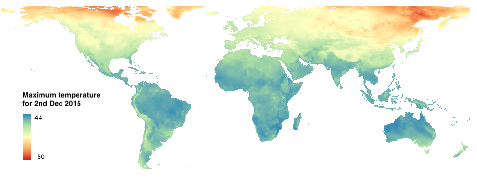

## Weather and climate: CHIRTS{.unnumbered}

CHIRTS-daily is a global 2-m maximum temperature (Tmax) product that combines the monthly CHIRTSmax data set with the ERA5 reanalysis to produce routinely updated data to support the monitoring of temperature extreme. To learn more about CHIRTS, read [Funk et al. (2019)](https://doi.org/10.1175/JCLI-D-18-0698.1).

### Dataset characteristics {.unlisted .unnumbered}
-   Spatial resolution: 0.05 x 0.05 degree
-   Spatial coverage: 60ºS to 70ºN
-   Temporal resolution: daily
-   Temporal coverage:1983-2016
-   Update frequency / latency: Unknown
-   Version: 1.0
-   License: Creative Commons
-   Official website: <https://www.chc.ucsb.edu/data/chirtsdaily>

### Variables included {.unlisted .unnumbered}

| Variable name | Description                                              | Temporal resolution | Units  |
|---------------|-----------------------------|---------------|---------------|
| Max. temperature | Maximum air temperature of the day measured at 2m above the surface | daily | ºC
| Min. temperature | Minimum air temperature of the day measured at 2m above the surface | daily | ºC
| Relative humidity | Average daily relative humidity | daily | %

### Sample image of the dataset {.unlisted .unnumbered}

