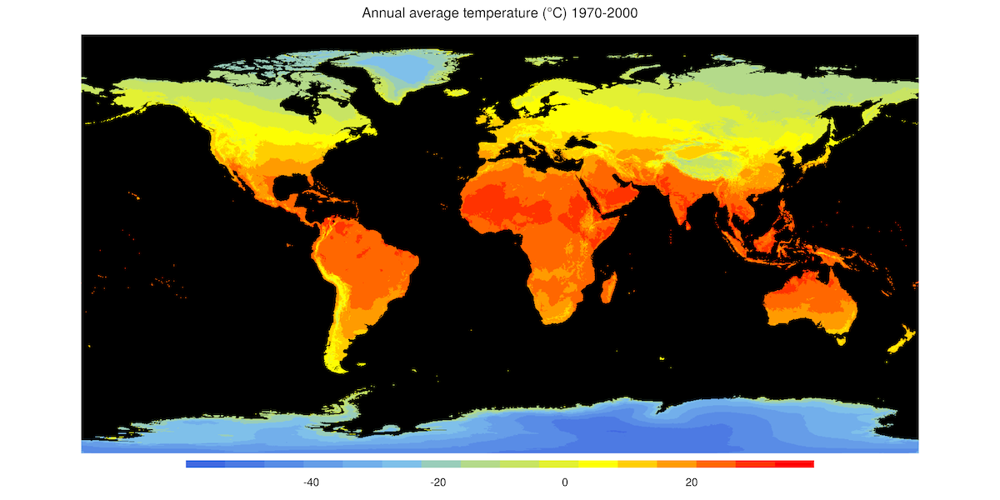

## Weather and climate: WorldClim{.unnumbered}

WorldClim is a database of high spatial resolution global weather and climate data. These data can be used for mapping and spatial modeling. The data are provided for use in research and related activities; and some specialized skill and knowledge is needed to use them. For technical detailes refer to [Fick and Hijmans, 2017)(https://rmets.onlinelibrary.wiley.com/doi/abs/10.1002/joc.5086)

### Dataset characteristics {.unlisted .unnumbered}
-   Spatial resolution: 30 arc-sec
-   Spatial coverage: 90ºN to 60ºS
-   Temporal resolution: monthly
-   Temporal coverage:1970-2000
-   Update frequency / latency: N/A
-   Version: 2.1
-   License: Unclear
-   Official website: <https://worldclim.org/>

### Variables included {.unlisted .unnumbered}

| Variable name | Description                                              | Temporal resolution | Units  |
|---------------|-----------------------------|---------------|---------------|
| Avg. temperature | Average monthly average temperature | monthly | ºC
| Max. temperature | Average monthly maximum temperature | monthly | ºC
| Min. temperature | Average monthly minimum temperature | monthly | ºC
| Precipitation | Total precipitation accumulated over the course of a month | monthly | mm/month
| Solar radiation | Monthly average solar radiation | monthly | kJ/m2/day
| Wind speed | Monthly average wind speed | monthly | m/s

### Sample image of the dataset {.unlisted .unnumbered}

