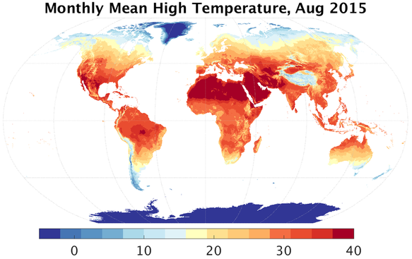

## Weather and climate: TerraClimate{.unnumbered}

TerraClimate is a dataset of monthly climate and climatic water balance for global terrestrial surfaces from 1958-2019. These data provide important inputs for ecological and hydrological studies at global scales that require high spatial resolution and time-varying data. All data have monthly temporal resolution and a ~4-km (1/24th degree) spatial resolution. The data cover the period from 1958-2020. We plan to update these data periodically (annually).

### Dataset characteristics {.unlisted .unnumbered}
-   Spatial resolution: 2.5 arc-min
-   Spatial coverage: 90ºN to 90ºS
-   Temporal resolution: monthly
-   Temporal coverage:1958-present
-   Update frequency / latency: yearly
-   Version: unk
-   License: Creative Commons
-   Official website: <https://www.climatologylab.org/terraclimate.html>

### Variables included {.unlisted .unnumbered}

| Variable name | Description                                              | Temporal resolution | Units  |
|---------------|-----------------------------|---------------|---------------|
| Max. temperature | Average monthly maximum temperature | monthly | ºC
| Min. temperature | Average monthly minimum temperature | monthly | ºC
| Precipitation | Total monthly accumulated precipitation | monthly | mm/month
| Solar radiation | Downward surface shortwave radiation | monthly | w/m2
| Wind speed | Monthly average wind speed | monthly | m/s

### Sample image of the dataset {.unlisted .unnumbered}

