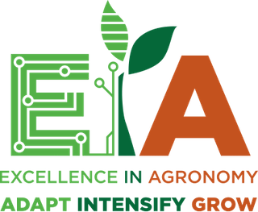

# Introduction {.unnumbered}

This book documents the structure, functions, and underpinning data for the [The AgWISE agronomy tool](https://github.com/AgWISE-EiA/AgWISE-generic). AgWISE builds on the [AKILIMO](https://github.com/IITA-AKILIMO) decision support tool, and through the TRANSFORM Team of the Excellence in Agronomy CGIAR Initiative is being developed to address the demand from many agronomic advisory use cases across the globe.

